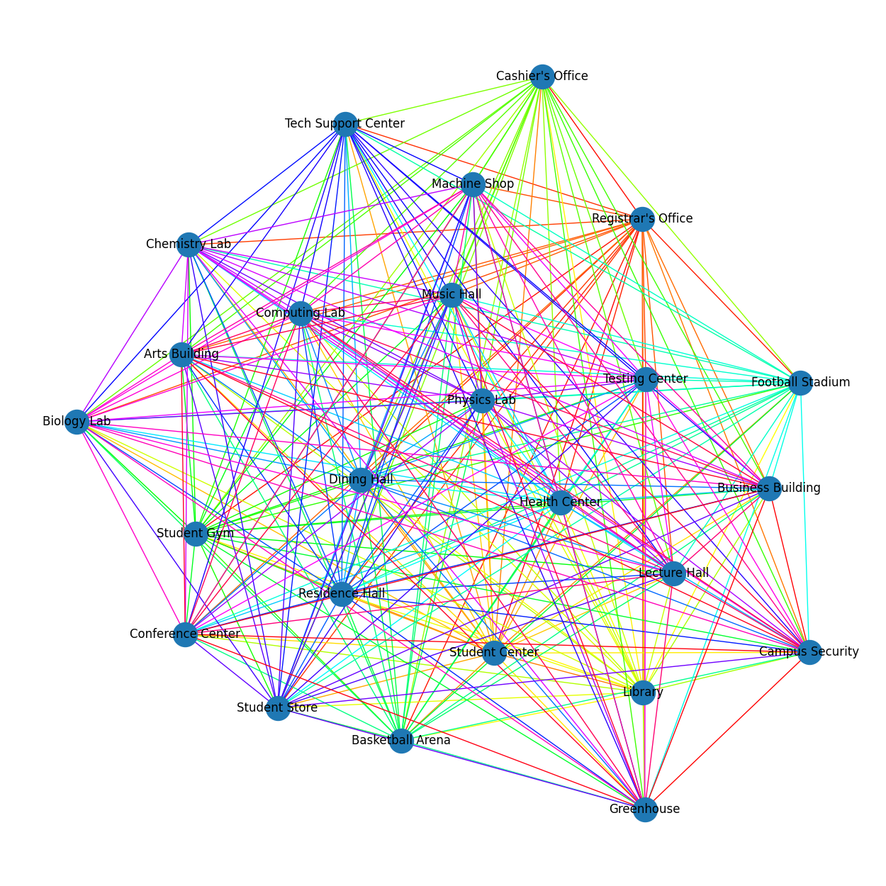
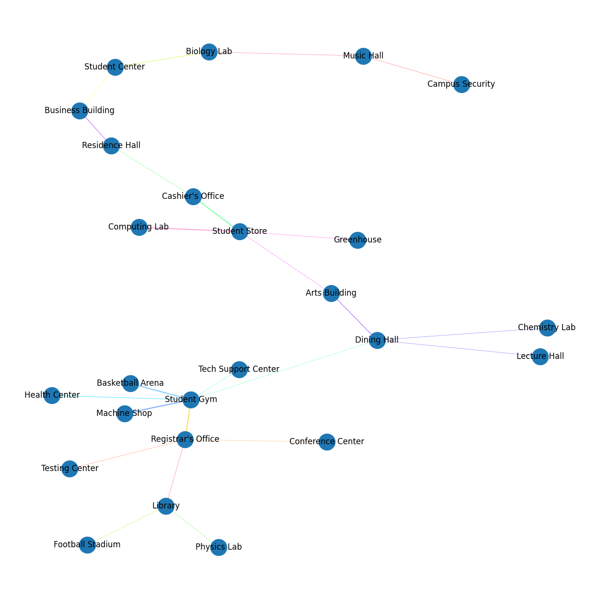
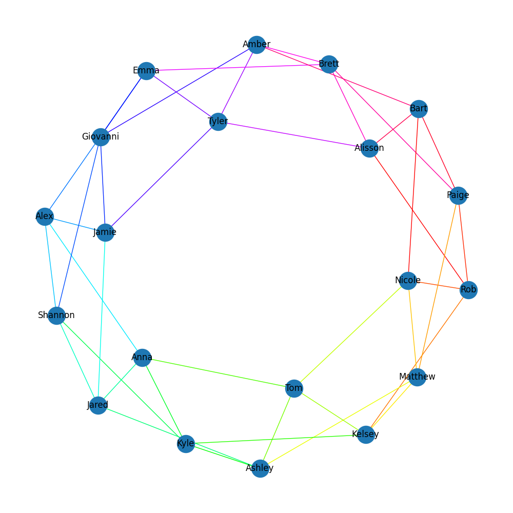
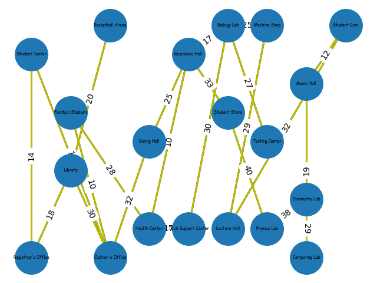

# Team Ramen - Graph Applications Problems

**CISC320 Spring 2023 Lesson 19 - Graph Applications**

Group Members:
* Galen Nare (gnare@udel.edu)
* Dylan Giletto (dgiletto@udel.edu)
* Daniel Yang (daniely@udel.edu)
* Fourth member (email)

Description of project

## Installation Code

```sh
$> pip install networkx
```

## Python Environment Setup

```python
import networkx as nx
import matplotlib.pyplot as plt
```

# The Shortest Path on Campus

**Informal Description**: The University of Mars has an important task for you. Since Mars is a relatively new planet to colonize, we need to be efficient with land.
We are asking you to find the shortest pathing between the Registrar's Office and the Student Gym. Each edge weight symbolizes the distance in meters between each building.

> **Formal Description**:
>  * Input: A graph where each edge weight represents the distance between buildings.
>  * Output: Prints the shortest path with its length and the nodes visited in order.

# Minimally connecting paths between University buildings

**Informal Description**: We need to connect a wired Internet network of buildings at some university with potential cable paths
(and the cost to build those paths as the weight of the edges), we want to find the set of paths that connects all the buildings
on campus while using as little resources as possible.

> **Formal Description**:
>  * Input: A set of university buildings (25 nodes) and a dense, procedurally generated set of edges connecting the nodes.
    Uses the formula `((hash(left_node) + hash(right_node)) % 20) + 1` for the weights.
>  * Output: A set of edges that connect all nodes in a Minimum Spanning Tree

**Graph Problem/Algorithm**: MST -- Kruskal's Algorithm

**Setup code**:

```python
import networkx as nx

from pprint import *

buildings = ["Registrar's Office", "Student Center", "Library", "Cashier's Office", "Student Gym", "Basketball Arena",
             "Football Stadium", "Health Center", "Dining Hall", "Residence Hall", "Tech Support Center",
             "Student Store", "Physics Lab", "Chemistry Lab", "Testing Center", "Biology Lab", "Machine Shop",
             "Lecture Hall", "Computing Lab", "Music Hall", "Arts Building", "Conference Center", "Business Building",
             "Greenhouse", "Campus Security"]

g = nx.Graph()
for i in range(len(buildings)):
    g.add_node(buildings[i])
    for j in range(i, len(buildings)):
        if buildings[j] is not buildings[i]:
            g.add_edge(buildings[i], buildings[j], weight=((hash(buildings[i]) + hash(buildings[j])) % 21) + 1)

pp = PrettyPrinter(indent=4, width=80)
pp.pprint(str(g))
```

**Visualization**:

"Before" graph (weights are represented by edge thickness, 
ranging from 1 to 20; using `matplotlib`:


**Solution code:**

```python
import matplotviz as viz
import buildings_setup as bs
import networkx as nx

if __name__ == '__main__':
    mst = nx.minimum_spanning_tree(bs.g, algorithm="kruskal")
    bs.pp.pprint(mst)
    bs.g.clear_edges()
    for edge in mst.edges(data=True):
        print(edge)
        bs.g.add_edge(edge[0], edge[1], weight=edge[2]['weight'])
    viz.draw_graph(bs.g, show_edge_weights=True)
```

**Output**

Edges selected for the Minimum Spanning Tree calculated by Kruskal's Algorithm:
```python
("Registrar's Office", 'Library', {'weight': 1})
("Registrar's Office", 'Testing Center', {'weight': 1})
("Registrar's Office", 'Conference Center', {'weight': 1})
("Registrar's Office", 'Student Gym', {'weight': 4})
('Student Center', 'Business Building', {'weight': 1})
('Student Center', 'Biology Lab', {'weight': 2})
('Library', 'Football Stadium', {'weight': 1})
('Library', 'Physics Lab', {'weight': 1})
("Cashier's Office", 'Residence Hall', {'weight': 1})
("Cashier's Office", 'Student Store', {'weight': 3})
('Student Gym', 'Dining Hall', {'weight': 1})
('Student Gym', 'Tech Support Center', {'weight': 1})
('Student Gym', 'Health Center', {'weight': 2})
('Student Gym', 'Basketball Arena', {'weight': 3})
('Student Gym', 'Machine Shop', {'weight': 3})
('Dining Hall', 'Chemistry Lab', {'weight': 1})
('Dining Hall', 'Lecture Hall', {'weight': 1})
('Dining Hall', 'Arts Building', {'weight': 2})
('Residence Hall', 'Business Building', {'weight': 2})
('Student Store', 'Arts Building', {'weight': 1})
('Student Store', 'Greenhouse', {'weight': 1})
('Student Store', 'Computing Lab', {'weight': 2})
('Biology Lab', 'Music Hall', {'weight': 1})
('Music Hall', 'Campus Security', {'weight': 1})
```

Visualization of the MST (edge weights visualized with line thickness):


**Interpretation of Results**:
    
With Kruskal's Algorithm we are able to find the least expensive way to connect all the
University buildings on this wired Internet network. This setup can find the solution for this type
of problem quickly, with any number of "buildings to connect". This could help network engineers
prototype a cost-effective solution for Universities or other multi-building campuses.

# Bipartite Seating Chart for the Coding Club

**Informal Description**: Rob, the president of the coding club, wants to set the seating for the first meeting of the coding club
so that the boys and girls are all interweaved with eachother allowing for more interactions and frienships to develop through
the club

> **Formal Description**:
>  * Input: A set of members of the club (20 nodes), with each node stemming out for 4 other members of the club, representing
    possible connections that can be made from the seating chart.
>  * Output: Whether the graph is bipartite or not dependent on boys and girls

**Graph Problem/Algorithm**: BFS

**Setup Code**:

```python
import networkx as nx

from pprint import *

boys = ["Rob", "Matthew", "Tom", "Kyle", "Jared", "Alex", "Giovanni", "Tyler", "Brett", "Bart"]
girls = ["Amber", "Alisson", "Paige", "Nicole", "Kelsey", "Ashley", "Anna", "Shannon", "Jamie", "Emma"]

g = nx.Graph()

g.add_nodes_from(boys)
g.add_nodes_from(girls)
for i in range(len(boys)):
    for j in range(1 , 5):
        if not g.has_edge(boys[i], girls[(i + j) % len(girls)]):
            g.add_edge(boys[i],girls[(j + i) % len(girls)])

pp = PrettyPrinter(indent=4, width=80)
pp.pprint(str(g))
```

**Visualization**
Proposed seating chart from Rob


**Solution Code:**

```python
import matplotviz as viz
import club_setup as cs

import networkx as nx

members = ["Rob", "Matthew", "Tom", "Kyle", "Jared", "Alex", "Giovanni", "Tyler", "Brett", 
           "Bart", "Amber", "Alisson", "Paige", "Nicole", "Kelsey", "Ashley", "Anna", "Shannon", "Jamie", "Emma"]
boys = ["Rob", "Matthew", "Tom", "Kyle", "Jared", "Alex", "Giovanni", "Tyler", "Brett", "Bart"]
girls = ["Amber", "Alisson", "Paige", "Nicole", "Kelsey", "Ashley", "Anna", "Shannon", "Jamie", "Emma"]

def is_bipartite(graph: nx.Graph, start: any) -> bool:
    queue = []
    queue.append(start)
    visited = []

    while queue:
        u = queue.pop()
        # Return false is there is a self loop
        if (graph.has_edge(u,u)):
            return False
        
        for v in range(len(graph.nodes)):
            if graph.has_edge(u,members[v]) and members[v] not in visited:
                if u in boys and members[v] in girls:
                    visited.append(members[v])
                    queue.append(members[v])
                elif u in girls and members[v] in boys:
                    visited.append(members[v])
                    queue.append(members[v])
                elif u in boys and members[v] in boys:
                    return False
                elif u in girls and members[v] in girls:
                    return False
    return True

if __name__ == "__main__":
    viz.draw_graph(cs.g, show_edge_weights=False)
    print(BFS.is_bipartite(cs.g, "Rob"))
```

**Output**

If the graph is bipartite or not
```python
True
```

**Interpretation of the Results**:

Using a Breadth First Search on the seating chart (graph) we can prove if the seat arrangment Rob proposed is bipartite or not. Since the result was True, we know that the proposed seating arrangement would achieve the goal of creating interactions between the girls and the boys of the club, and is truly bipartite.

# The Shortest Path on Campus

**Informal Description**: The University of Mars has an important task for you. Since Mars is a relatively new planet to colonize, we need to be efficient with land.
We are asking you to find the shortest pathing between the Registrar's Office and the Student Gym. Each edge weight symbolizes the distance in meters between each building.

> **Formal Description**:
>  * Input: A graph where each edge weight represents the distance between buildings.
>  * Output: Prints the shortest path with its length and the nodes visited in order.

**Graph Problem/Algorithm**: Djikstra's Algorithm


**Setup code**:

```python
import networkx as nx
from pprint import *
import matplotlib.pyplot as plt

G = nx.Graph()

nodes = [["Registrar's Office", 1, 1],["Student Center", 1, 8],["Library", 2, 4],["Cashier's Office", 3, 1],["Basketball Arena", 3, 9],
         ["Football Stadium", 2, 6],["Health Center", 4, 2],["Dining Hall", 4, 5],["Residence Hall", 5, 8],["Tech Support Center", 5, 2],
         ["Student Store", 6, 6],["Physics Lab", 7, 2],["Chemistry Lab", 8, 3],["Testing Center", 7, 5],["Biology Lab", 6, 9],
         ["Machine Shop", 7, 9],["Lecture Hall", 6, 2],["Computing Lab", 8, 1],["Music Hall", 8, 7],["Student Gym", 9, 9]]

for node in nodes:
    G.add_node(node[0], pos = (node[1], node[2]))

edges = [
    ["Registrar's Office", "Student Center", 14],
    ["Registrar's Office", "Library", 18],
    ["Library", "Basketball Arena", 20],
    ["Library", "Cashier's Office", 30],
    ["Student Center", "Cashier's Office", 15],
    ["Cashier's Office", "Football Stadium", 10],
    ["Football Stadium", "Health Center", 28],
    ["Health Center", "Residence Hall", 10],
    ["Cashier's Office", "Dining Hall", 32],
    ["Dining Hall", "Residence Hall", 25],
    ["Health Center", "Tech Support Center", 17],
    ["Tech Support Center", "Biology Lab", 30],
    ["Residence Hall", "Biology Lab", 17],
    ["Residence Hall", "Student Store", 33],
    ["Student Store", "Physics Lab", 40],
    ["Physics Lab", "Chemistry Lab", 38],
    ["Chemistry Lab", "Computing Lab", 29],
    ["Computing Lab", "Music Hall", 19],
    ["Music Hall", "Student Gym", 12],
    ["Student Store", "Testing Center", 12],
    ["Biology Lab", "Testing Center", 27],
    ["Biology Lab", "Machine Shop", 25],
    ["Machine Shop", "Lecture Hall", 29],
    ["Lecture Hall", "Student Gym", 32],
]

for pair in edges:
    G.add_edge(pair[0], pair[1], weight = int(pair[2]))

#Drawing Graph: 

# nodes
nx.draw_networkx_nodes(G, pos = nx.get_node_attributes(G,'pos'), node_size=1600)

# edges
nx.draw_networkx_edges(G, pos = nx.get_node_attributes(G,'pos'), width=2)
nx.draw_networkx_edges(G, pos = nx.get_node_attributes(G,'pos'), width=2, alpha=1, edge_color="y")

# node labels
nx.draw_networkx_labels(G, pos = nx.get_node_attributes(G,'pos'), font_size=5, font_family="cursive")

# edge weight labels
edge_labels = nx.get_edge_attributes(G, "weight")
nx.draw_networkx_edge_labels(G, pos = nx.get_node_attributes(G,'pos'), edge_labels=edge_labels)

ax = plt.gca()
ax.margins(0.02)
plt.axis("off")
plt.tight_layout()
plt.show()
```

**Visualization**:



**Solution code:**

```
def solution (G: nx.Graph) -> nx.Graph:
    solution = nx.single_source_dijkstra(G, "Registrar's Office", "Student Gym")
    print("The shortest path from Registrar's Office to Student Gym is: ")
    print(solution)
    return solution

solution(G)
```

**Output**

```
The shortest path from Registrar's Office to Student Gym is: 
(180, ["Registrar's Office", 'Student Center', "Cashier's Office", 'Football Stadium', 'Health Center', 'Residence Hall', 'Biology Lab', 'Machine Shop', 'Lecture Hall', 'Student Gym'])
```

**Interpretation of Results**:

With the use of Djikstra's Algorithm on the graph of the University of Mars' campus, we can calculate the shortest path between two locations very easily. 
Now we know the shortest distance between the Registrar's Office and the Student Gym, while also finding the locations visited in-between. We can also use
this algorithm for any other pair of destinations on this graph.