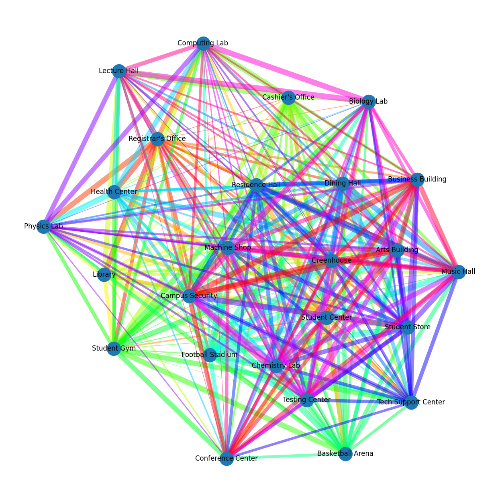
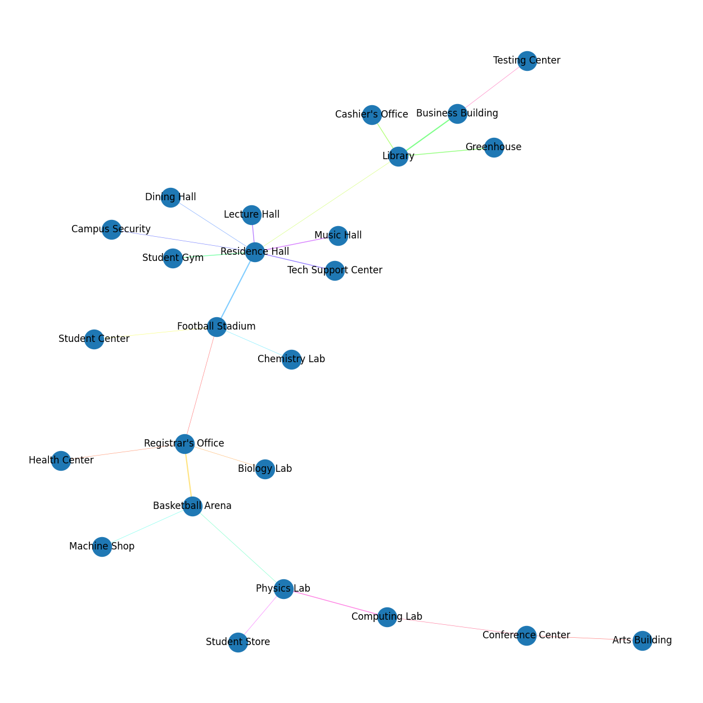

# Team Ramen - Graph Applications Problems

**CISC320 Spring 2023 Lesson 19 - Graph Applications**

Group Members:
* Galen Nare (gnare@udel.edu)
* Second member (email)
* Third member (email)
* Fourth member (email)

Description of project

## Installation Code

```sh
$> pip install networkx
```

## Python Environment Setup

```python
import networkx as nx
import matplotlib.pyplot as plt
```

# First Problem Title

**Informal Description**: 

> **Formal Description**:
>  * Input:
>  * Output:

# Minimally connecting paths between University buildings

**Informal Description**: We need to connect a wired Internet network of buildings at some university with potential cable paths
(and the cost to build those paths as the weight of the edges), we want to find the set of paths that connects all the buildings
on campus while using as little resources as possible.

> **Formal Description**:
>  * Input: A set of university buildings (25 nodes) and a dense, procedurally generated set of edges connecting the nodes.
    Uses the formula `((hash(left_node) + hash(right_node)) % 20) + 1` for the weights.
>  * Output: A set of edges that connect all nodes in a Minimum Spanning Tree

**Graph Problem/Algorithm**: MST -- Kruskal's Algorithm


**Setup code**:

```python
import networkx as nx

from pprint import *

buildings = ["Registrar's Office", "Student Center", "Library", "Cashier's Office", "Student Gym", "Basketball Arena",
             "Football Stadium", "Health Center", "Dining Hall", "Residence Hall", "Tech Support Center",
             "Student Store", "Physics Lab", "Chemistry Lab", "Testing Center", "Biology Lab", "Machine Shop",
             "Lecture Hall", "Computing Lab", "Music Hall", "Arts Building", "Conference Center", "Business Building",
             "Greenhouse", "Campus Security"]

g = nx.Graph()
for i in range(len(buildings)):
    g.add_node(buildings[i])
    for j in range(i, len(buildings)):
        if buildings[j] is not buildings[i]:
            g.add_edge(buildings[i], buildings[j], weight=((hash(buildings[i]) + hash(buildings[j])) % 21) + 1)

pp = PrettyPrinter(indent=4, width=80)
pp.pprint(str(g))
```

**Visualization**:

"Before" graph (weights are represented by edge thickness, 
ranging from 1 to 20; using `matplotlib`:


**Solution code:**

```python
import matplotviz as viz
import buildings_setup as bs

import networkx as nx


class Vertex(str):
    """
        Wrapper class for vertices
    """
    pass


class DisjointSets:
    """
        Disjoint sets implementation from lesson 18
    """
    def __init__(self, nodes: list[Vertex]):
        self.parents = {}
        for node in nodes:
            self.parents[node] = node

    def find(self, current: Vertex) -> Vertex:
        while self.parents[current] != current:
            current = self.parents[current]
        return current

    def union(self, left: Vertex, right: Vertex):
        left_root = self.find(left)
        right_root = self.find(right)
        if left_root != right_root:
            self.parents[right_root] = left_root
        return left_root != right_root


def kruskals_algorithm(graph: nx.Graph) -> list[tuple]:
    """
        Kruskal's Algorithm implementation adapted from lesson 18, takes in a networkx graphs and returns a list of
        networkx compatible edges of the Minimum-Spanning Tree.
    """
    vertices = [Vertex(node) for node in graph]
    forest = DisjointSets(vertices)
    mst = []
    edges = sorted([edge for edge in graph.edges.data()], key=lambda edge: edge[2]['weight'])
    c = 1
    for edge in edges:
        left, right = edge[:2]
        result = forest.union(left, right)
        if result:
            mst.append((left, right, edge[2]))
        print(str(c), str(tuple((left, right))), result, forest.parents, '\n')  # Debug statement for alg, comment for less output
        c += 1
    return mst


if __name__ == '__main__':
    mst = kruskals_algorithm(bs.g)
    bs.pp.pprint(mst)
    bs.g.clear_edges()
    for edge in mst:
        bs.g.add_edge(edge[0], edge[1], weight=edge[2]['weight'])
    viz.draw_graph(bs.g, show_edge_weights=True)
```

**Output**

Edges selected for the Minimum Spanning Tree calculated by Kruskal's Algorithm:
```python
[   ("Registrar's Office", 'Football Stadium', {'weight': 1}),
    ("Registrar's Office", 'Health Center', {'weight': 1}),
    ("Registrar's Office", 'Biology Lab', {'weight': 1}),
    ('Student Center', 'Football Stadium', {'weight': 1}),
    ('Library', 'Residence Hall', {'weight': 1}),
    ('Basketball Arena', 'Physics Lab', {'weight': 1}),
    ('Basketball Arena', 'Machine Shop', {'weight': 1}),
    ('Football Stadium', 'Chemistry Lab', {'weight': 1}),
    ('Dining Hall', 'Residence Hall', {'weight': 1}),
    ('Residence Hall', 'Campus Security', {'weight': 1}),
    ('Student Store', 'Physics Lab', {'weight': 1}),
    ('Testing Center', 'Business Building', {'weight': 1}),
    ('Computing Lab', 'Conference Center', {'weight': 1}),
    ('Arts Building', 'Conference Center', {'weight': 1}),
    ('Library', "Cashier's Office", {'weight': 2}),
    ('Library', 'Greenhouse', {'weight': 2}),
    ('Student Gym', 'Residence Hall', {'weight': 2}),
    ('Residence Hall', 'Tech Support Center', {'weight': 2}),
    ('Residence Hall', 'Lecture Hall', {'weight': 2}),
    ('Residence Hall', 'Music Hall', {'weight': 2}),
    ('Physics Lab', 'Computing Lab', {'weight': 2}),
    ("Registrar's Office", 'Basketball Arena', {'weight': 3}),
    ('Library', 'Business Building', {'weight': 3}),
    ('Football Stadium', 'Residence Hall', {'weight': 3})]
```

Visualization of the MST (edge weights visualized with line thickness):


**Interpretation of Results**:
    
With Kruskal's Algorithm we are able to find the least expensive way to connect all the
University buildings on this wired Internet network. This setup can find the solution for this type
of problem quickly, with any number of "buildings to connect". This could help network engineers
prototype a cost-effective solution for Universities or other multi-building campuses.
